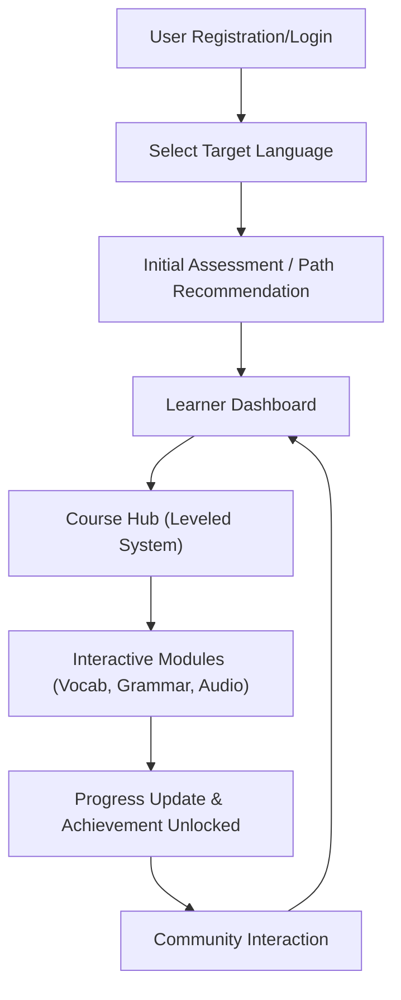

## 1. Product Overview
An online education platform designed for an immersive language learning experience supporting English, Japanese, Korean, and other mainstream languages.
- Main purpose is to provide structured, leveled courses combined with gamified, interactive learning modules (vocabulary, grammar, oral shadowing, listening).
- Target audience includes language learners seeking a comprehensive, personalized path with robust progress tracking and community engagement.

## 2. Core Features

### 2.1 User Roles
| Role | Registration Method | Core Permissions |
|------|---------------------|------------------|
| Learner | Email/Social Login | Access courses, track progress, participate in community, earn achievements |
| Admin | Internal creation | Manage content, monitor users, moderate community |

### 2.2 Feature Module
1. **Landing/Auth Page**: Hero section, language selection prompt, user registration and login.
2. **Learner Dashboard**: Learning progress tracking, personalized learning path recommendations, daily streaks.
3. **Course Hub**: Leveled course system categorized by language (English, Japanese, Korean, etc.).
4. **Interactive Learning Modules**: Vocabulary memorization, grammar exercises, oral shadowing (speech recognition mock), listening training.
5. **Community & Achievements**: Leaderboards, user discussion threads, badge collection.

### 2.3 Page Details
| Page Name | Module Name | Feature description |
|-----------|-------------|---------------------|
| Landing | Hero Section | High-impact value proposition, CTA for sign up |
| Auth | Login/Register Form | Secure authentication flow |
| Dashboard | Progress Tracker | Visual representation of language mastery, recent activities, recommended next lesson |
| Course Catalog | Level Selection | Grid of available courses filtered by difficulty and language |
| Lesson View | Interactive Exercises | Flashcards, fill-in-the-blanks, audio playback for listening/shadowing |
| Community | Social Feed | Peer interactions, achievement showcases, language exchange |

## 3. Core Process
The user registers and selects their target language. They take an initial assessment or start from level 1. Based on this, a personalized path is recommended. The user engages daily with interactive modules (vocabulary, grammar, listening, shadowing). Their progress is tracked, and milestones are rewarded with achievements, which they can showcase in the community.

## 4. User Interface Design
### 4.1 Design Style
- **Aesthetic**: Playful, modern, and engaging (gamified aesthetic without feeling childish). 
- **Colors**: Vibrant Indigo (Primary), Mint Green (Success/Progress), Soft Coral (Accents), with a clean off-white background.
- **Button style**: Slightly rounded (pill shape), soft drop shadows for depth, interactive hover states (scale up).
- **Font and sizes**: Bold, friendly sans-serif (e.g., 'Nunito' or 'Quicksand') for headings, highly legible sans-serif (e.g., 'Inter') for body text.
- **Layout style**: Card-based interface with ample whitespace, sticky side navigation for desktop, bottom tab bar for mobile.
- **Icon/emoji style suggestions**: Flat vector illustrations with subtle gradients, expressive emojis for community interactions.

### 4.2 Page Design Overview
| Page Name | Module Name | UI Elements |
|-----------|-------------|-------------|
| Dashboard | Progress Tracker | Circular progress rings, streak flame icons, colorful cards |
| Lesson View | Interactive Exercises | Large typography for vocabulary, audio wave visualization for shadowing, interactive input fields |
| Community | Social Feed | Avatar circles, badge icons, nested comment threads |

### 4.3 Responsiveness
Desktop-first approach with fluid grids. Highly touch-optimized for mobile devices, ensuring buttons and interactive exercise elements (like flashcard swipes or recording buttons) are easily accessible with thumbs.