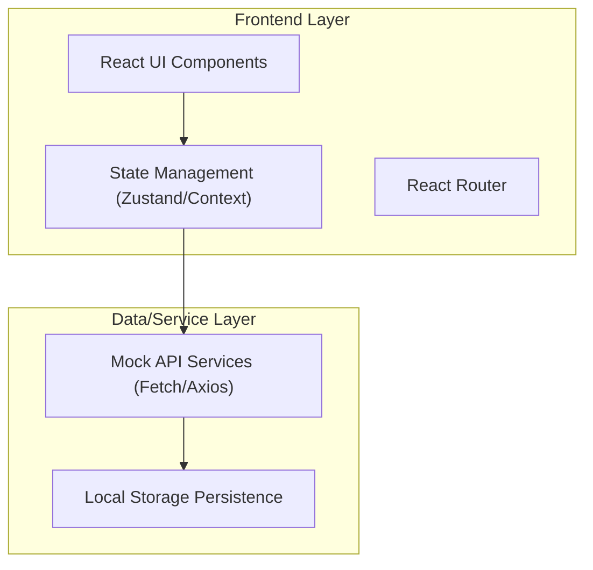
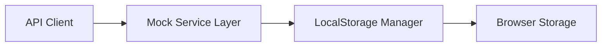
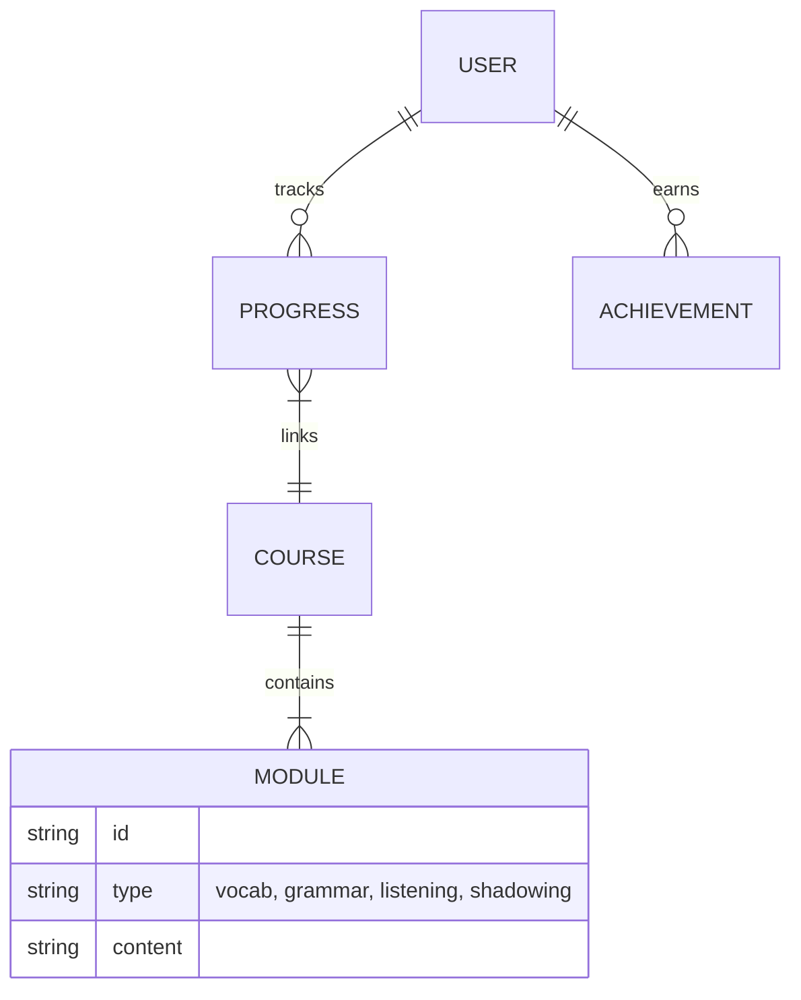

## 1. Architecture Design


## 2. Technology Description
- Frontend: React@18 + tailwindcss@3 + vite
- UI Components: Radix UI primitives or headless UI (if needed), Lucide React for icons, Framer Motion for animations
- Initialization Tool: vite-init
- State Management: Zustand (or React Context for simplicity)
- Mocking: MSW or custom mock service layer using LocalStorage for persistence

## 3. Route Definitions
| Route | Purpose |
|-------|---------|
| `/` | Landing page |
| `/login` | User authentication |
| `/dashboard` | Learner home, progress, and path recommendations |
| `/courses` | Leveled course catalog |
| `/courses/:courseId/lesson/:lessonId` | Interactive learning module interface |
| `/community` | Social interaction and achievements |

## 4. API Definitions (Mock Backend)
```typescript
interface User {
  id: string;
  name: string;
  email: string;
  targetLanguage: string;
  currentLevel: string;
  xp: number;
  streak: number;
}

interface Course {
  id: string;
  language: string;
  level: string;
  title: string;
  description: string;
  modules: string[];
}

interface Progress {
  userId: string;
  courseId: string;
  completedModules: string[];
  score: number;
}
```

## 5. Server Architecture Diagram (Mocked for Frontend)


## 6. Data Model
### 6.1 Data Model Definition


### 6.2 Data Definition Language
Since this is a frontend-heavy application, we will rely on seeded JSON data stored in LocalStorage upon first load to simulate a database.