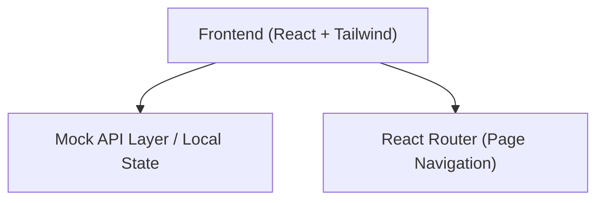
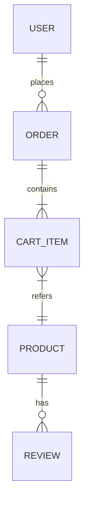

## 1. 架构设计



## 2. 技术说明
- **前端框架**：React@18 + Vite
- **样式方案**：Tailwind CSS (支持黑白灰主色调和米色/深蓝点缀的快速配置)
- **图标库**：Lucide React (提供统一风格的现代线性图标)
- **路由**：React Router v6
- **状态管理**：Zustand (用于购物车、全局提示和用户登录状态的轻量级管理)
- **动画**：Framer Motion (实现自然流畅的页面切换和微交互动效)

## 3. 路由定义
| 路由 | 目的 |
|------|------|
| `/` | 首页 |
| `/login` | 登录/注册页 |
| `/products` | 商品列表页 |
| `/product/:id` | 商品详情页 |
| `/cart` | 购物车页 |
| `/checkout` | 结算填写地址页 |
| `/payment` | 模拟支付页 |
| `/orders` | 历史订单页 |
| `/contact` | 联系我们页 |
| `*` | 404 及未上线功能空状态页（敬请期待） |

## 4. 数据模型设计 (Mock)

### 4.1 数据模型定义


### 4.2 核心数据结构定义
```typescript
interface User {
  id: string;
  email: string;
}

interface Product {
  id: string;
  name: string;
  price: number;
  images: string[];
  sizes: string[];
  description: string;
  reviews: Review[];
  isNew?: boolean;
  isHot?: boolean;
}

interface Review {
  id: string;
  user: string;
  rating: number;
  comment: string;
  date: string;
}

interface CartItem {
  id: string;
  product: Product;
  size: string;
  quantity: number;
}

interface Order {
  id: string;
  items: CartItem[];
  totalAmount: number;
  shippingAddress: Address;
  status: 'paid' | 'shipped';
  date: string;
}

interface Address {
  name: string;
  phone: string;
  province: string;
  city: string;
  detail: string;
}
```
