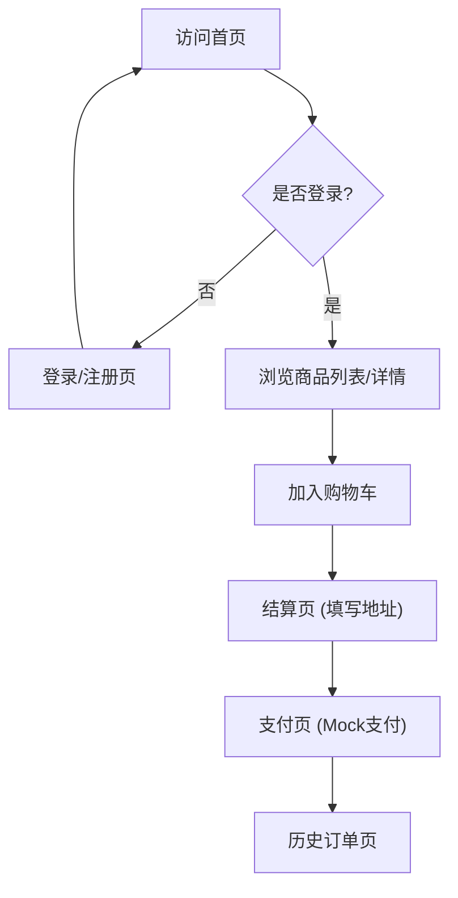

## 1. 产品概述
打造一个面向中国消费者的女装电商网站，整体风格参考 Zara 和 H&M。
网站设计简洁现代，适配手机端浏览，提供从浏览、加购、结算到支付的完整购物体验。

## 2. 核心功能

### 2.1 用户角色
| 角色 | 注册方式 | 核心权限 |
|------|----------|----------|
| 普通用户 | 邮箱注册登录 | 浏览商品、加购、下单、支付、查看历史订单 |

### 2.2 功能模块
1. **首页**：轮播图、新品推荐、热销商品、新用户弹窗
2. **注册登录页**：邮箱登录/注册
3. **商品列表页**：展示各类目商品
4. **商品详情页**：商品大图展示、尺码信息、用户评价、加入购物车
5. **购物车与结算**：购物车列表、填写收货地址、结算确认
6. **支付**：Mock支付流程，点击支付直接付款完成
7. **历史订单页**：查看过往订单记录
8. **联系我们**：通过邮件联系官方

### 2.3 页面详情
| 页面名称 | 模块名称 | 功能描述 |
|----------|----------|----------|
| 首页 | 轮播图、商品推荐 | 展示最新活动大图，推荐新品与热销单品，展示新用户弹窗 |
| 登录/注册页 | 邮箱表单 | 用户通过邮箱完成账号注册和登录 |
| 商品列表页 | 商品流 | 瀑布流或网格形式展示商品大图，点击进入详情 |
| 商品详情页 | 商品信息展示 | 高清大图展示，尺码选择，查看用户评价，加购按钮 |
| 购物车 | 订单项列表 | 展示已选商品，可修改数量或删除，点击结算进入下一步 |
| 结算页 | 地址填写 | 输入收货地址信息，确认订单金额 |
| 支付页 | Mock支付 | 模拟支付流程，点击后提示支付成功并跳转至订单页 |
| 历史订单页 | 订单列表 | 展示用户的历史订单信息及状态 |
| 联系我们 | 联系方式 | 提供官方联系邮箱 |

## 3. 核心流程

## 4. 用户界面设计
### 4.1 设计风格
- **主色调**：黑白灰为主，极简主义。
- **点缀色**：柔和的米色或深蓝色。
- **排版与布局**：使用大图展示商品，页面布局留白充足，简洁现代，遵循桌面优先兼顾移动端的自适应设计。
- **动效**：交互动效自然流畅（如图片Hover放大、平滑滚动、淡入淡出）。
- **图标**：使用风格统一的现代线性Icon，绝不使用Emoji。
- **空状态**：未上线的页面统一显示“敬请期待”。

### 4.2 页面设计概览
| 页面名称 | 模块名称 | UI元素 |
|----------|----------|--------|
| 首页 | 轮播图、推荐区 | 极简风格大图、深色按钮、优雅的排版、淡入动效 |
| 商品详情 | 图片库、信息面板 | 左侧/上方大图滑动，右侧/下方信息选择，米色背景点缀 |
| 结算页 | 表单区 | 简洁的输入框，黑色实心按钮，清晰的订单摘要 |

### 4.3 响应式
桌面优先原则，同时完美适配移动端浏览（如移动端采用汉堡菜单、单列商品流、底部固定加购按钮等）。
